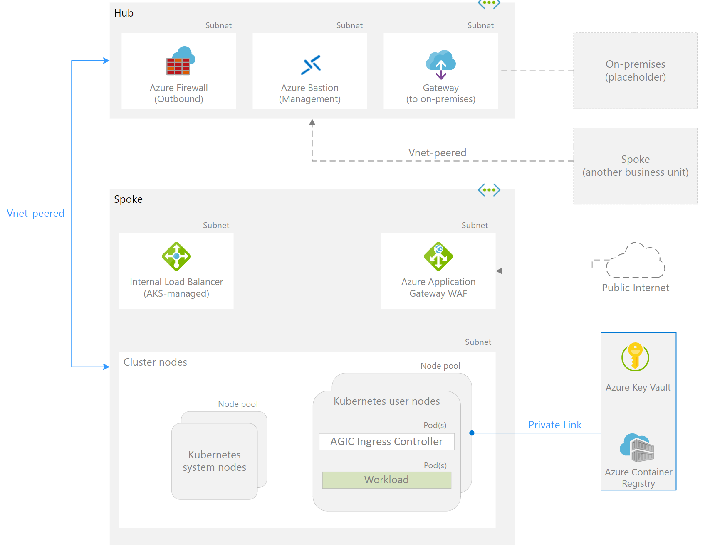

# Secure Baseline for Enterprise-scale for AKS
This reference implementation demonstrates the recommended starting (baseline) infrastructure architecture for a general purpose AKS cluster. This implementation and document is meant to guide an interdisciplinary team or multiple distinct teams like networking, security and development through the process of getting this secure baseline infrastructure deployed and understanding the components of it. This reference implementation is based on the [AKS secure baseline](https://github.com/mspnp/aks-secure-baseline) modified for Enterprise-scale for AKS.

By the end of this, you would have deployed a secure AKS cluster, complient with Enterprise-scale for AKS guidance and best practices. We will also be deploying a workload known as the Ratings app that is also featured in the [Azure Kubernetes Services Workshop](https://docs.microsoft.com/en-us/learn/modules/aks-workshop/). Check out the workshop for some intermediate level training on AKS.

For this scenario, we have various IaC technology that you can choose from depending on your preference. At this time only the Terraform version is available. Below is an architectural diagram of this scenario.

## Core architecture components
* AKS
* Azure Virtual Networks (hub-spoke)
  * Azure Firewall managed egress
* Azure Application Gateway (WAF)
* Application Gateway Ingress Controller
* AKS-managed Internal Load Balancer
* Azure CNI
* Azure Keyvault
* Azure Container registry
* Azure Bastion
* Azure Monitor for containers
* Azure firewall
* MongoDB 
* Helm
* [Secret store CSI driver](https://docs.microsoft.com/azure/aks/csi-secrets-store-driver)
* [Azure RBAC for Kubernetes Authorization](https://docs.microsoft.com/azure/aks/manage-azure-rbac)
* [Azure Active Directory pod-managed identities](https://docs.microsoft.com/azure/aks/use-azure-ad-pod-identity)

## Some of the differences Between this RI and the AKS  Secure Baseline

Here are some of the differences between the Enterprise scale reference implementation of an AKS secure baseline and the [AKS secure baseline](https://github.com/mspnp/aks-secure-baseline) the RI is based on

* As of now, GitOps is not used in this scenario. GitHub CI/CD pipeline used instead
* AGIC used instead of Traefik ingress controller
* ACR and Key vault are used that are accessed via private link. This requires the use of Bastion host to build the image for the private ACR.
* The templates are broken down in a way to promote separation of duties and modularity and the steps are broken into stages
* Reference implementations in Terraform and Bicep
* More recent Add-ons are used 

## Steps of Implementation for AKS Construction Set

A deployment of AKS-hosted workloads typically experiences a separation of duties and lifecycle management in the area of prerequisites, the host network, the cluster infrastructure, and finally the workload itself. This reference implementation is similar. Also, be aware our primary purpose is to illustrate the topology and decisions of a baseline cluster. We feel a "step-by-step" flow will help you learn the pieces of the solution and give you insight into the relationship between them. Ultimately, lifecycle/SDLC management of your cluster and its dependencies will depend on your situation (team roles, organizational standards, etc), and will be implemented as appropriate for your needs.

## Next
Pick one of the IaC options below and follow the instructions to deploy the AKS reference implementation.

:arrow_forward: [Terraform](./Terraform)

:arrow_forward: [Bicep (still in development)](./Bicep)

:arrow_forward: [For ARM, use official AKS Secure Baseline RI](https://github.com/mspnp/aks-secure-baseline)